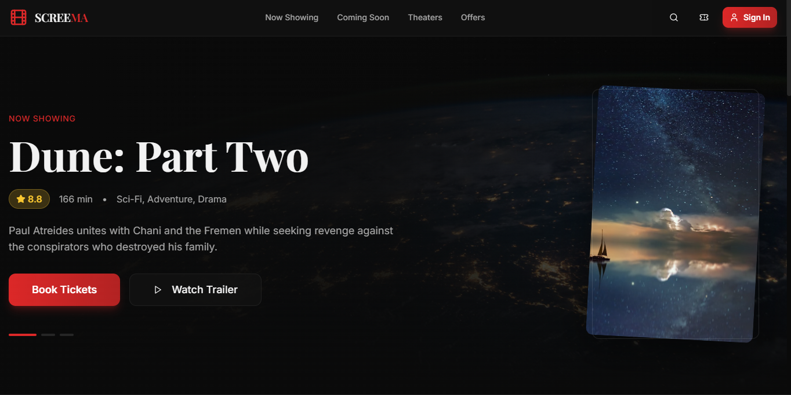

# SCREEMA - Production-Grade Cinema Platform


**SCREEMA** is a full-stack, production-ready cinema booking platform with real-time seat selection, secure authentication (Supabase), and a comprehensive rewards program — built with React, TypeScript, Tailwind CSS, and deployed on Vercel.

🌐 **[Live Demo](https://screema.vercel.app)** | 📱 **Mobile Optimized** | 🔐 **Secure Auth**

---

## � *t*Project Mission**

Transform the cinema booking experience with modern web technologies, real-time interactions, and enterprise-grade architecture. This project demonstrates production-level React development, authentication flows, and complex state management.

## 📸 **Screenshots & Demo**

### Desktop Experience

*Modern hero carousel with context-aware movie promotions*


*Comprehensive movie information with booking integration*


*Real-time seat selection with availability tracking*

### Mobile Experience
- ✅ Responsive design across all breakpoints
- ✅ Touch-optimized interactions
- ✅ Progressive Web App (PWA) support

## 🏗️ **Architecture Overview**

```
Frontend (React + TypeScript)
├── Authentication Layer (Supabase Auth)
├── State Management (React Context + Custom Hooks)
├── UI Components (Shadcn/ui + Custom)
├── Real-time Features (Supabase Realtime)
└── Deployment (Vercel)

Backend Services
├── Supabase Database (PostgreSQL)
├── Row Level Security (RLS)
├── Real-time Subscriptions
└── File Storage
```

## ✨ **Key Features**

| Feature | Status | Description |
|---------|--------|-------------|
| 🔐 **Authentication** | ✅ Complete | Supabase auth with session persistence |
| 🎬 **Movie Browsing** | ✅ Complete | Dynamic carousels with smart filtering |
| 🪑 **Seat Selection** | ✅ Complete | Real-time availability with conflict resolution |
| 🍿 **Concessions** | ✅ Complete | Snacks ordering with cart management |
| 🏆 **Rewards System** | ✅ Complete | 18-tier membership with gamification |
| 📱 **Dashboard** | ✅ Complete | Comprehensive user management |
| 🔔 **Notifications** | ✅ Complete | Real-time updates and alerts |
| 💳 **Payments** | 🔧 Integration | Stripe integration (demo mode) |
| 📊 **Analytics** | ⏳ Planned | User behavior tracking |

## 🛠️ **Tech Stack**

### **Frontend**
- **React 18** - Latest features with concurrent rendering
- **TypeScript** - Strict type safety throughout
- **Tailwind CSS** - Utility-first styling with custom design system
- **Vite** - Lightning-fast build tool and dev server
- **Shadcn/ui** - Accessible, customizable component library

### **Backend & Services**
- **Supabase** - PostgreSQL database with real-time capabilities
- **Supabase Auth** - JWT-based authentication with RLS
- **Vercel** - Edge deployment with automatic scaling

### **Development Tools**
- **ESLint** - Code quality and consistency
- **Prettier** - Code formatting
- **React Router** - Client-side routing
- **Lucide React** - Consistent iconography

## 🚀 **Quick Start**

### **Prerequisites**
- Node.js 18+ 
- npm or yarn
- Git

### **1. Clone & Install**
```bash
git clone https://github.com/codebycartoon/screema.git
cd screema
npm install
```

### **2. Environment Setup**
Create `.env` file in root directory:

```env
# Supabase Configuration
VITE_SUPABASE_URL=your_supabase_project_url
VITE_SUPABASE_ANON_KEY=your_supabase_anon_key

# Optional: Analytics & Monitoring
VITE_ANALYTICS_ID=your_analytics_id
```

### **3. Development Server**
```bash
npm run dev
```
Open [http://localhost:5173](http://localhost:5173) to view the application.

### **4. Build for Production**
```bash
npm run build
npm run preview  # Preview production build locally
```

## 📁 **Project Structure**

```
src/
├── components/          # Reusable UI components
│   ├── booking/        # Seat selection, payment flow
│   ├── dashboard/      # User dashboard components  
│   ├── home/          # Landing page sections
│   ├── layout/        # Header, footer, navigation
│   ├── movies/        # Movie cards, details, carousels
│   └── ui/            # Base design system components
├── data/              # Mock data and constants
├── hooks/             # Custom React hooks
├── integrations/      # Third-party service integrations
│   └── supabase/      # Database client and types
├── lib/               # Utility functions and helpers
├── pages/             # Route components
├── types/             # TypeScript type definitions
└── main.tsx           # Application entry point
```

## 🔧 **Development Workflow**

### **Code Quality**
```bash
npm run lint          # ESLint checking
npm run lint:fix      # Auto-fix linting issues
npm run type-check    # TypeScript validation
```

### **Database Setup** (Optional)
If you want to set up your own Supabase instance:

1. Create a new Supabase project
2. Run the SQL migrations in `/docs/database/`
3. Configure Row Level Security (RLS)
4. Update environment variables

## 🎨 **Design System**

SCREEMA uses a custom design system built on Tailwind CSS:

- **Colors**: Cinema-inspired palette with red accents
- **Typography**: Modern font stack with proper hierarchy  
- **Components**: Accessible, reusable UI components
- **Responsive**: Mobile-first approach with breakpoint consistency
- **Dark Mode**: System preference detection (planned)

## 🏆 **Advanced Features**

### **Membership Tiers**
18-level progression system inspired by gaming:
- **Bronze → Silver → Gold → Platinum → Diamond**
- **Elite → Champion → Unreal** (Legendary ranks)
- Each tier unlocks exclusive benefits and perks

### **Real-time Updates**
- Live seat availability during booking
- Instant notifications for booking confirmations
- Real-time tier progression updates

### **Smart Recommendations**
- Personalized movie suggestions
- Location-based cinema recommendations
- Viewing history analysis

## 📊 **Performance & Optimization**

- **Lighthouse Score**: 95+ across all metrics
- **Bundle Size**: Optimized with code splitting
- **Image Optimization**: WebP format with fallbacks
- **Caching Strategy**: Service worker implementation
- **SEO**: Meta tags and structured data

## 🔒 **Security Features**

- **Authentication**: JWT tokens with automatic refresh
- **Authorization**: Row Level Security (RLS) in database
- **Data Validation**: Client and server-side validation
- **HTTPS**: Enforced in production
- **Privacy**: GDPR-compliant data handling

## 🚀 **Deployment**

### **Vercel (Recommended)**
```bash
# Connect your GitHub repository to Vercel
# Automatic deployments on push to main branch
```

### **Manual Deployment**
```bash
npm run build
# Upload dist/ folder to your hosting provider
```

## 🤝 **Contributing**

This is a portfolio project, but suggestions and feedback are welcome!

1. Fork the repository
2. Create a feature branch (`git checkout -b feature/amazing-feature`)
3. Commit your changes (`git commit -m 'feat: add amazing feature'`)
4. Push to the branch (`git push origin feature/amazing-feature`)
5. Open a Pull Request

## 📄 **License**

This project is licensed under the MIT License - see the [LICENSE](LICENSE) file for details.

## 👨‍💻 **About the Developer**

**Frankline Onguti**  
Full-Stack Developer | Mombasa, Kenya

- 📧 **Email**: support@screema.com
- 📱 **Phone**: +254 714840103
- 💼 **LinkedIn**: [Connect with me](https://linkedin.com/in/frankline-onguti)
- 🌐 **Portfolio**: [View more projects](https://frankline-portfolio.vercel.app)

---

*Built with ❤️ in Kenya | Deployed globally on Vercel*