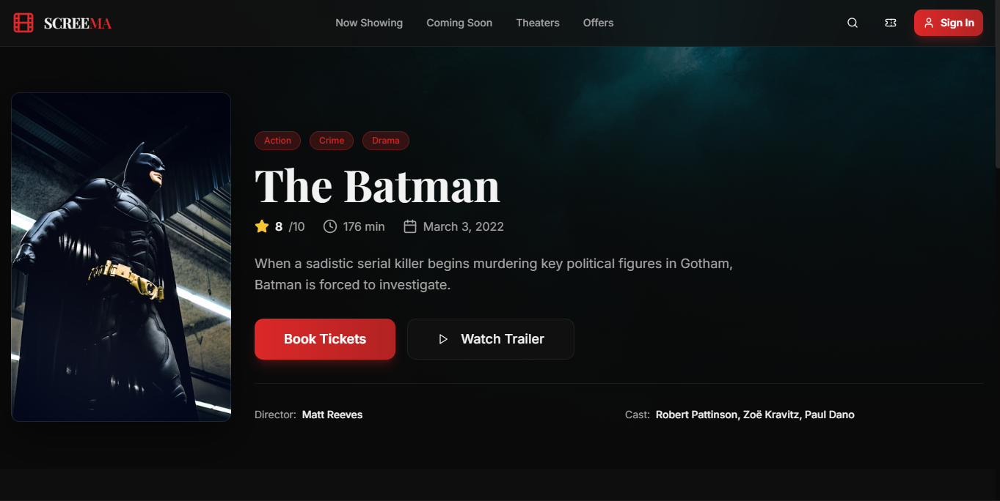
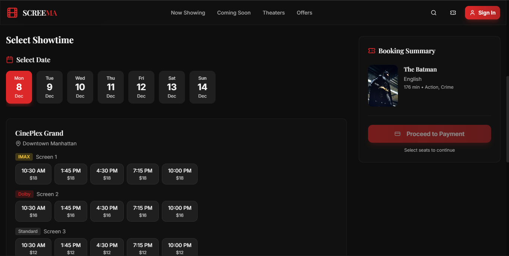
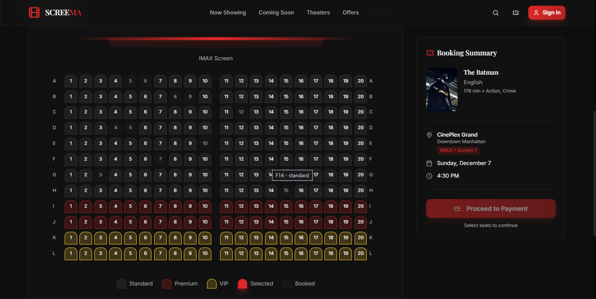

<div align="center">

# 🎬 SCREEMA

### Modern Cinema Ticket Booking Platform

*A production-ready movie ticket booking system with real-time seat selection, authentication, and payment integration*

[](https://reactjs.org/)
[](https://www.typescriptlang.org/)
[](https://tailwindcss.com/)
[](https://vitejs.dev/)

**[🚀 Live Demo](https://screema.vercel.app)** • **[📖 Documentation](#-documentation)** • **[🎯 Features](#-features)** • **[⚙️ Installation](#️-installation)**

</div>

---

## 📸 Application Preview

<div align="center">

### Homepage & Movie Browsing


### Movie Details & Showtime Selection
 

### Interactive Seat Selection System


</div>

---

## 🎯 Features

### Core Functionality
- ✅ **Movie Catalog** - Browse movies with detailed information, ratings, and trailers
- ✅ **Smart Seat Selection** - Interactive seat map with real-time availability tracking
- ✅ **Showtime Management** - Multiple screening times with dynamic pricing
- ✅ **User Authentication** - Secure sign-up/sign-in with session management
- ✅ **Booking System** - Complete booking flow from selection to confirmation
- ✅ **Payment Integration** - Secure payment processing workflow
- ✅ **Booking History** - View, manage, and cancel reservations
- ✅ **QR Code Tickets** - Digital ticket generation for easy check-in

### Technical Highlights
- 🎨 **Modern UI/UX** - Built with shadcn/ui and Radix UI primitives
- 📱 **Fully Responsive** - Mobile-first design with adaptive layouts
- ⚡ **Performance Optimized** - Code splitting, lazy loading, and optimized builds
- 🔒 **Type-Safe** - End-to-end TypeScript for reliability
- 🎭 **Smooth Animations** - Framer Motion-inspired transitions
- 🧩 **Component Architecture** - Modular, reusable component design
- 🔄 **State Management** - TanStack Query for server state
- 🎣 **Custom Hooks** - Reusable logic with React hooks pattern

---

## 🏗️ Architecture

### System Design

```
┌─────────────┐      ┌──────────────┐      ┌─────────────┐
│   Client    │─────▶│  React App   │─────▶│  Supabase   │
│  (Browser)  │      │   (Vite)     │      │  (Backend)  │
└─────────────┘      └──────────────┘      └─────────────┘
                            │
                            ├─ React Router (Navigation)
                            ├─ TanStack Query (Data Fetching)
                            ├─ Zod (Validation)
                            └─ shadcn/ui (Components)
```

### Component Hierarchy

```
App
├── AuthProvider (Context)
├── QueryClientProvider (Data Layer)
└── BrowserRouter (Routing)
    ├── Index (Homepage)
    │   ├── HeroSection
    │   ├── FeaturesSection
    │   └── MovieGrid
    │       └── MovieCard[]
    ├── MovieDetail
    │   ├── MovieHero
    │   ├── ShowtimeSelector
    │   └── SeatMap
    ├── Payment
    │   └── BookingSummary
    ├── Bookings (User Dashboard)
    └── Auth (Login/Signup)
```

---

## 🛠️ Tech Stack

### Frontend Core
| Technology | Version | Purpose |
|-----------|---------|---------|
| React | 18.3.1 | UI Framework |
| TypeScript | 5.8.3 | Type Safety |
| Vite | 5.4.19 | Build Tool & Dev Server |
| React Router | 6.30.1 | Client-side Routing |

### Styling & UI
| Technology | Purpose |
|-----------|---------|
| Tailwind CSS | Utility-first CSS framework |
| shadcn/ui | Pre-built accessible components |
| Radix UI | Headless UI primitives |
| Lucide React | Icon library |
| tailwindcss-animate | Animation utilities |

### State & Data Management
| Technology | Purpose |
|-----------|---------|
| TanStack Query | Server state management |
| React Hook Form | Form handling |
| Zod | Schema validation |
| Context API | Global state (Auth) |

### Development Tools
| Technology | Purpose |
|-----------|---------|
| ESLint | Code linting |
| TypeScript ESLint | TS-specific linting |
| PostCSS | CSS processing |
| Autoprefixer | CSS vendor prefixes |

---

## ⚙️ Installation

### Prerequisites
- Node.js 18+ and npm/yarn
- Git

### Quick Start

```bash
# Clone the repository
git clone https://github.com/codebycartoon/screema.git
cd screema

# Install dependencies
npm install

# Start development server
npm run dev
```

The app will be available at `http://localhost:5173`

### Build for Production

```bash
# Create optimized production build
npm run build

# Preview production build locally
npm run preview
```

### Environment Setup

Create a `.env` file in the root directory:

```env
# Supabase Configuration (Optional - currently using mock data)
VITE_SUPABASE_URL=your_supabase_project_url
VITE_SUPABASE_ANON_KEY=your_supabase_anon_key
```

---

## 📁 Project Structure

```
screema/
├── src/
│   ├── components/
│   │   ├── booking/           # Booking flow components
│   │   │   ├── SeatMap.tsx
│   │   │   ├── ShowtimeSelector.tsx
│   │   │   └── BookingSummary.tsx
│   │   ├── home/              # Homepage sections
│   │   │   ├── HeroSection.tsx
│   │   │   ├── FeaturesSection.tsx
│   │   │   └── MovieGrid.tsx
│   │   ├── layout/            # Layout components
│   │   │   ├── Header.tsx
│   │   │   └── Footer.tsx
│   │   ├── movies/            # Movie display components
│   │   │   ├── MovieCard.tsx
│   │   │   └── MovieHero.tsx
│   │   └── ui/                # shadcn/ui components (50+ components)
│   ├── pages/                 # Route pages
│   │   ├── Index.tsx          # Homepage
│   │   ├── MovieDetail.tsx    # Movie details & booking
│   │   ├── Auth.tsx           # Authentication
│   │   ├── Payment.tsx        # Payment processing
│   │   ├── Bookings.tsx       # User bookings dashboard
│   │   └── NotFound.tsx       # 404 page
│   ├── hooks/                 # Custom React hooks
│   │   ├── useAuth.tsx        # Authentication logic
│   │   ├── use-toast.ts       # Toast notifications
│   │   └── use-mobile.tsx     # Responsive breakpoints
│   ├── integrations/          # External services
│   │   └── supabase/          # Supabase client & types
│   ├── lib/                   # Utilities
│   │   └── utils.ts           # Helper functions (cn, etc.)
│   ├── types/                 # TypeScript definitions
│   ├── data/                  # Mock data
│   │   └── movies.ts          # Sample movie data
│   ├── App.tsx                # Root component
│   ├── main.tsx               # Entry point
│   └── index.css              # Global styles
├── public/                    # Static assets
├── screenshots/               # Application screenshots
├── dist/                      # Production build output
├── package.json               # Dependencies & scripts
├── tsconfig.json              # TypeScript configuration
├── vite.config.ts             # Vite configuration
├── tailwind.config.ts         # Tailwind configuration
└── README.md                  # This file
```

---

## 🎬 User Flow

### Booking Journey

```
1. Browse Movies
   └─▶ View movie catalog with filters

2. Select Movie
   └─▶ View details, ratings, trailer
       └─▶ Choose showtime

3. Select Seats
   └─▶ Interactive seat map
       └─▶ Choose seat type (Regular/Premium/VIP)
           └─▶ View real-time availability

4. Review Booking
   └─▶ Confirm selection & pricing
       └─▶ Proceed to payment

5. Payment
   └─▶ Enter payment details
       └─▶ Process transaction

6. Confirmation
   └─▶ Receive booking confirmation
       └─▶ Generate QR code ticket
           └─▶ View in booking history
```

---

## 🚀 Available Scripts

| Command | Description |
|---------|-------------|
| `npm run dev` | Start development server with HMR |
| `npm run build` | Build optimized production bundle |
| `npm run build:dev` | Build in development mode |
| `npm run preview` | Preview production build locally |
| `npm run lint` | Run ESLint for code quality |

---

## 🎨 Key Components

### SeatMap Component
Interactive seat selection with:
- Real-time availability tracking
- Multiple seat types (Regular, Premium, VIP)
- Visual seat status indicators
- Touch-friendly mobile interface

### ShowtimeSelector Component
Dynamic showtime selection featuring:
- Date picker with available dates
- Time slots with capacity indicators
- Dynamic pricing based on time/seat type

### MovieCard Component
Reusable movie display with:
- Lazy-loaded images
- Hover animations
- Rating display
- Quick action buttons

---

## 📊 Database Schema

### Movies Table
```typescript
{
  id: string
  title: string
  description: string
  genre: string[]
  duration: number
  rating: number
  releaseDate: string
  posterUrl: string
  trailerUrl: string
}
```

### Bookings Table
```typescript
{
  id: string
  userId: string
  movieId: string
  showtimeId: string
  seats: string[]
  totalPrice: number
  status: 'pending' | 'confirmed' | 'cancelled'
  createdAt: timestamp
}
```

### Showtimes Table
```typescript
{
  id: string
  movieId: string
  date: string
  time: string
  availableSeats: number
  price: number
}
```

---

## 🌐 Deployment

### Deploy to Vercel (Recommended)

```bash
# Install Vercel CLI
npm i -g vercel

# Deploy
vercel
```

Or connect your GitHub repo to Vercel for automatic deployments.

### Deploy to Netlify

```bash
# Build the project
npm run build

# Deploy dist folder to Netlify
```

### Deploy to GitHub Pages

```bash
# Install gh-pages
npm install -D gh-pages

# Add to package.json scripts:
"deploy": "npm run build && gh-pages -d dist"

# Deploy
npm run deploy
```

---

## 🔒 Security Considerations

- ✅ Environment variables for sensitive data
- ✅ Input validation with Zod schemas
- ✅ XSS protection via React's built-in escaping
- ✅ HTTPS enforced in production
- ✅ Secure authentication flow
- ⚠️ Payment integration requires PCI compliance

---

## 🧪 Testing Strategy

### Recommended Testing Approach
```bash
# Unit Tests - Vitest
npm install -D vitest @testing-library/react

# E2E Tests - Playwright
npm install -D @playwright/test

# Component Tests - Storybook
npm install -D @storybook/react
```

---

## 🗺️ Roadmap

### Phase 1: Core Features ✅
- [x] Movie browsing and details
- [x] Seat selection system
- [x] User authentication
- [x] Booking flow
- [x] Responsive design

### Phase 2: Enhancements 🚧
- [ ] Real backend integration (Supabase/Firebase)
- [ ] Payment gateway (Stripe/PayPal)
- [ ] Email notifications
- [ ] SMS confirmations
- [ ] Admin dashboard

### Phase 3: Advanced Features 🔮
- [ ] Movie recommendations (ML-based)
- [ ] Social features (reviews, ratings)
- [ ] Loyalty program
- [ ] Multi-language support
- [ ] PWA capabilities
- [ ] Real-time seat updates (WebSockets)

---

## 🤝 Contributing

Contributions are welcome! Please follow these steps:

1. Fork the repository
2. Create a feature branch (`git checkout -b feature/AmazingFeature`)
3. Commit your changes (`git commit -m 'feat: add amazing feature'`)
4. Push to the branch (`git push origin feature/AmazingFeature`)
5. Open a Pull Request

### Commit Convention
Follow [Conventional Commits](https://www.conventionalcommits.org/):
- `feat:` New feature
- `fix:` Bug fix
- `docs:` Documentation changes
- `style:` Code style changes (formatting)
- `refactor:` Code refactoring
- `test:` Adding tests
- `chore:` Maintenance tasks

---

## 📄 License

This project is licensed under the MIT License - see the [LICENSE](LICENSE) file for details.

---

## 👨‍💻 Author

<div align="center">

**Frankline Onguti**

Third Year Computer Science Student | Chuka University

[](https://github.com/codebycartoon)
[](mailto:franklineonguti4@gmail.com)
[](https://maps.google.com/?q=Mombasa,Kenya)

*Built as a portfolio project demonstrating modern React development, TypeScript proficiency, and full-stack web development capabilities.*

</div>

---

## 🙏 Acknowledgments

- **UI Components**: [shadcn/ui](https://ui.shadcn.com/) - Beautifully designed components
- **Icons**: [Lucide](https://lucide.dev/) - Clean, consistent icon set
- **Design Inspiration**: Modern cinema platforms (BookMyShow, Fandango)
- **Community**: React, TypeScript, and Tailwind CSS communities

---

<div align="center">

### ⭐ Star this repo if you find it helpful!

**[Report Bug](https://github.com/codebycartoon/screema/issues)** • **[Request Feature](https://github.com/codebycartoon/screema/issues)**

Made with ❤️ by [Frankline Onguti](https://github.com/codebycartoon)

</div>
