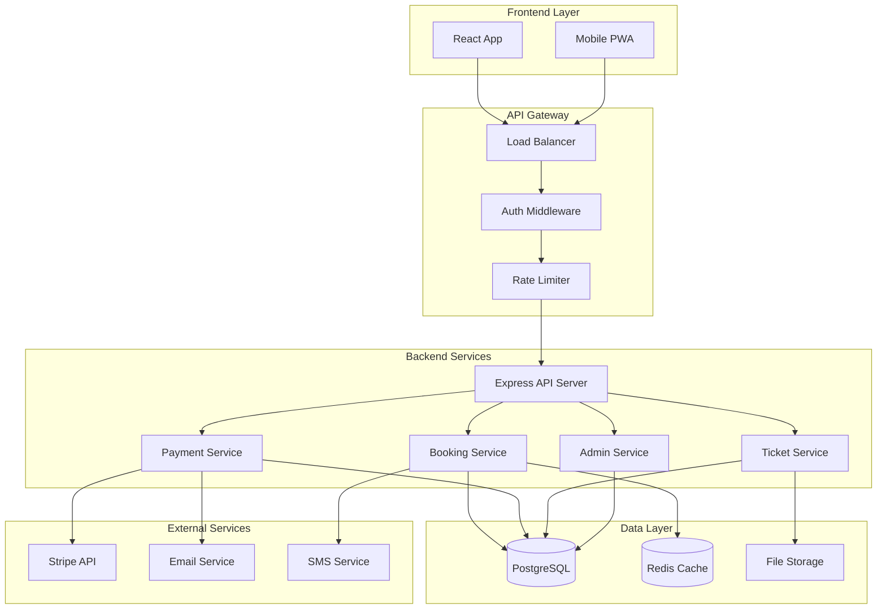

# SCREEMA Backend Architecture

## 🏗️ **System Architecture Overview**



## 🗄️ **Database Schema Design**

### **Core Tables**

```sql
-- Users with role-based access
CREATE TABLE users (
    id UUID PRIMARY KEY DEFAULT gen_random_uuid(),
    email VARCHAR(255) UNIQUE NOT NULL,
    password_hash VARCHAR(255) NOT NULL,
    full_name VARCHAR(255) NOT NULL,
    phone VARCHAR(20),
    role user_role DEFAULT 'customer',
    tier_id VARCHAR(50) DEFAULT 'bronze',
    points INTEGER DEFAULT 0,
    email_verified BOOLEAN DEFAULT FALSE,
    phone_verified BOOLEAN DEFAULT FALSE,
    created_at TIMESTAMP DEFAULT NOW(),
    updated_at TIMESTAMP DEFAULT NOW()
);

CREATE TYPE user_role AS ENUM ('customer', 'admin', 'operator');

-- Cinema theaters and screens
CREATE TABLE theaters (
    id UUID PRIMARY KEY DEFAULT gen_random_uuid(),
    name VARCHAR(255) NOT NULL,
    location VARCHAR(255) NOT NULL,
    total_screens INTEGER NOT NULL,
    created_at TIMESTAMP DEFAULT NOW()
);

CREATE TABLE screens (
    id UUID PRIMARY KEY DEFAULT gen_random_uuid(),
    theater_id UUID REFERENCES theaters(id),
    screen_number INTEGER NOT NULL,
    total_seats INTEGER NOT NULL,
    seat_layout JSONB NOT NULL, -- Flexible seat configuration
    created_at TIMESTAMP DEFAULT NOW(),
    UNIQUE(theater_id, screen_number)
);

-- Movies catalog
CREATE TABLE movies (
    id UUID PRIMARY KEY DEFAULT gen_random_uuid(),
    title VARCHAR(255) NOT NULL,
    description TEXT,
    duration INTEGER NOT NULL, -- minutes
    rating VARCHAR(10),
    genres TEXT[],
    cast TEXT[],
    director VARCHAR(255),
    poster_url VARCHAR(500),
    backdrop_url VARCHAR(500),
    trailer_url VARCHAR(500),
    release_date DATE,
    status movie_status DEFAULT 'upcoming',
    created_at TIMESTAMP DEFAULT NOW()
);

CREATE TYPE movie_status AS ENUM ('upcoming', 'now_showing', 'ended');

-- Showtimes
CREATE TABLE showtimes (
    id UUID PRIMARY KEY DEFAULT gen_random_uuid(),
    movie_id UUID REFERENCES movies(id),
    screen_id UUID REFERENCES screens(id),
    start_time TIMESTAMP NOT NULL,
    end_time TIMESTAMP NOT NULL,
    base_price DECIMAL(10,2) NOT NULL,
    available_seats INTEGER NOT NULL,
    created_at TIMESTAMP DEFAULT NOW(),
    INDEX idx_showtimes_movie_time (movie_id, start_time),
    INDEX idx_showtimes_screen_time (screen_id, start_time)
);

-- Seat locking for concurrency control
CREATE TABLE seat_locks (
    id UUID PRIMARY KEY DEFAULT gen_random_uuid(),
    showtime_id UUID REFERENCES showtimes(id),
    seat_numbers TEXT[] NOT NULL,
    user_id UUID REFERENCES users(id),
    lock_token VARCHAR(255) UNIQUE NOT NULL,
    expires_at TIMESTAMP NOT NULL,
    created_at TIMESTAMP DEFAULT NOW(),
    INDEX idx_seat_locks_showtime (showtime_id),
    INDEX idx_seat_locks_expires (expires_at)
);

-- Bookings
CREATE TABLE bookings (
    id UUID PRIMARY KEY DEFAULT gen_random_uuid(),
    user_id UUID REFERENCES users(id),
    showtime_id UUID REFERENCES showtimes(id),
    seat_numbers TEXT[] NOT NULL,
    total_amount DECIMAL(10,2) NOT NULL,
    discount_amount DECIMAL(10,2) DEFAULT 0,
    final_amount DECIMAL(10,2) NOT NULL,
    status booking_status DEFAULT 'pending',
    booking_reference VARCHAR(20) UNIQUE NOT NULL,
    payment_intent_id VARCHAR(255),
    qr_code VARCHAR(500),
    expires_at TIMESTAMP,
    created_at TIMESTAMP DEFAULT NOW(),
    updated_at TIMESTAMP DEFAULT NOW(),
    INDEX idx_bookings_user (user_id),
    INDEX idx_bookings_showtime (showtime_id),
    INDEX idx_bookings_reference (booking_reference)
);

CREATE TYPE booking_status AS ENUM ('pending', 'confirmed', 'cancelled', 'expired', 'used');

-- Snacks and concessions
CREATE TABLE snacks (
    id UUID PRIMARY KEY DEFAULT gen_random_uuid(),
    name VARCHAR(255) NOT NULL,
    description TEXT,
    price DECIMAL(8,2) NOT NULL,
    category VARCHAR(100) NOT NULL,
    image_url VARCHAR(500),
    available BOOLEAN DEFAULT TRUE,
    created_at TIMESTAMP DEFAULT NOW()
);

-- Booking snacks (many-to-many)
CREATE TABLE booking_snacks (
    id UUID PRIMARY KEY DEFAULT gen_random_uuid(),
    booking_id UUID REFERENCES bookings(id),
    snack_id UUID REFERENCES snacks(id),
    quantity INTEGER NOT NULL,
    unit_price DECIMAL(8,2) NOT NULL,
    total_price DECIMAL(8,2) NOT NULL
);

-- Payment transactions
CREATE TABLE payments (
    id UUID PRIMARY KEY DEFAULT gen_random_uuid(),
    booking_id UUID REFERENCES bookings(id),
    stripe_payment_intent_id VARCHAR(255) UNIQUE,
    amount DECIMAL(10,2) NOT NULL,
    currency VARCHAR(3) DEFAULT 'USD',
    status payment_status DEFAULT 'pending',
    payment_method VARCHAR(100),
    failure_reason TEXT,
    created_at TIMESTAMP DEFAULT NOW(),
    updated_at TIMESTAMP DEFAULT NOW()
);

CREATE TYPE payment_status AS ENUM ('pending', 'succeeded', 'failed', 'cancelled', 'refunded');

-- Notifications
CREATE TABLE notifications (
    id UUID PRIMARY KEY DEFAULT gen_random_uuid(),
    user_id UUID REFERENCES users(id),
    title VARCHAR(255) NOT NULL,
    message TEXT NOT NULL,
    type notification_type NOT NULL,
    is_read BOOLEAN DEFAULT FALSE,
    metadata JSONB,
    created_at TIMESTAMP DEFAULT NOW(),
    INDEX idx_notifications_user_unread (user_id, is_read)
);

CREATE TYPE notification_type AS ENUM ('booking', 'payment', 'promotion', 'system', 'tier_upgrade');
```

## 🔧 **API Endpoints Specification**

### **Authentication Endpoints**

```typescript
// POST /api/auth/register
interface RegisterRequest {
  email: string;
  password: string;
  fullName: string;
  phone?: string;
}

interface RegisterResponse {
  user: User;
  accessToken: string;
  refreshToken: string;
}

// POST /api/auth/login
interface LoginRequest {
  email: string;
  password: string;
}

interface LoginResponse {
  user: User;
  accessToken: string;
  refreshToken: string;
}

// POST /api/auth/refresh
interface RefreshRequest {
  refreshToken: string;
}

interface RefreshResponse {
  accessToken: string;
  refreshToken: string;
}
```

### **Booking Endpoints**

```typescript
// POST /api/bookings/lock-seats
interface LockSeatsRequest {
  showtimeId: string;
  seatNumbers: string[];
}

interface LockSeatsResponse {
  lockToken: string;
  expiresAt: string;
  lockedSeats: string[];
}

// POST /api/bookings
interface CreateBookingRequest {
  showtimeId: string;
  seatNumbers: string[];
  snacks?: BookingSnack[];
  lockToken: string;
}

interface CreateBookingResponse {
  booking: Booking;
  paymentClientSecret: string;
}

// GET /api/bookings/:id
interface BookingResponse {
  booking: Booking;
  showtime: Showtime;
  movie: Movie;
  theater: Theater;
  screen: Screen;
}
```

### **Payment Endpoints**

```typescript
// POST /api/payments/create-intent
interface CreatePaymentIntentRequest {
  bookingId: string;
  amount: number;
}

interface CreatePaymentIntentResponse {
  clientSecret: string;
  paymentIntentId: string;
}

// POST /api/payments/webhook
// Stripe webhook handler for payment events
interface StripeWebhookEvent {
  type: string;
  data: {
    object: any;
  };
}

// POST /api/payments/refund
interface RefundRequest {
  bookingId: string;
  reason?: string;
}

interface RefundResponse {
  refundId: string;
  amount: number;
  status: string;
}
```

### **Movie & Showtime Endpoints**

```typescript
// GET /api/movies
interface MoviesQuery {
  status?: 'now_showing' | 'upcoming';
  genre?: string;
  search?: string;
  page?: number;
  limit?: number;
}

interface MoviesResponse {
  movies: Movie[];
  pagination: {
    page: number;
    limit: number;
    total: number;
    totalPages: number;
  };
}

// GET /api/movies/:id/showtimes
interface ShowtimesQuery {
  date?: string;
  theaterId?: string;
}

interface ShowtimesResponse {
  showtimes: ShowtimeWithAvailability[];
}

interface ShowtimeWithAvailability extends Showtime {
  availableSeats: number;
  seatMap: SeatStatus[][];
}
```

### **Admin Endpoints**

```typescript
// POST /api/admin/movies
interface CreateMovieRequest {
  title: string;
  description: string;
  duration: number;
  rating: string;
  genres: string[];
  cast: string[];
  director: string;
  releaseDate: string;
  posterUrl?: string;
  backdropUrl?: string;
  trailerUrl?: string;
}

// POST /api/admin/showtimes
interface CreateShowtimeRequest {
  movieId: string;
  screenId: string;
  startTime: string;
  basePrice: number;
}

// GET /api/admin/analytics
interface AnalyticsResponse {
  totalBookings: number;
  totalRevenue: number;
  occupancyRate: number;
  popularMovies: MovieStats[];
  revenueByDate: RevenueData[];
}
```

## 🔒 **Security Implementation**

### **Authentication Middleware**

```typescript
import jwt from 'jsonwebtoken';
import { Request, Response, NextFunction } from 'express';

interface AuthenticatedRequest extends Request {
  user: {
    id: string;
    email: string;
    role: UserRole;
  };
}

export const authenticateToken = (req: AuthenticatedRequest, res: Response, next: NextFunction) => {
  const authHeader = req.headers['authorization'];
  const token = authHeader && authHeader.split(' ')[1];

  if (!token) {
    return res.status(401).json({ error: 'Access token required' });
  }

  jwt.verify(token, process.env.JWT_SECRET!, (err, user) => {
    if (err) {
      return res.status(403).json({ error: 'Invalid or expired token' });
    }
    req.user = user as any;
    next();
  });
};

export const requireRole = (roles: UserRole[]) => {
  return (req: AuthenticatedRequest, res: Response, next: NextFunction) => {
    if (!roles.includes(req.user.role)) {
      return res.status(403).json({ error: 'Insufficient permissions' });
    }
    next();
  };
};
```

### **Rate Limiting**

```typescript
import rateLimit from 'express-rate-limit';
import RedisStore from 'rate-limit-redis';
import Redis from 'ioredis';

const redis = new Redis(process.env.REDIS_URL!);

// General API rate limiting
export const apiLimiter = rateLimit({
  store: new RedisStore({
    sendCommand: (...args: string[]) => redis.call(...args),
  }),
  windowMs: 15 * 60 * 1000, // 15 minutes
  max: 100, // limit each IP to 100 requests per windowMs
  message: 'Too many requests from this IP, please try again later.',
});

// Strict rate limiting for booking endpoints
export const bookingLimiter = rateLimit({
  store: new RedisStore({
    sendCommand: (...args: string[]) => redis.call(...args),
  }),
  windowMs: 60 * 1000, // 1 minute
  max: 5, // limit each IP to 5 booking attempts per minute
  message: 'Too many booking attempts, please try again later.',
});
```

## ⚡ **Concurrency Control**

### **Seat Locking Service**

```typescript
import Redis from 'ioredis';
import { v4 as uuidv4 } from 'uuid';

export class SeatLockingService {
  private redis: Redis;
  private lockTTL = 10 * 60; // 10 minutes in seconds

  constructor() {
    this.redis = new Redis(process.env.REDIS_URL!);
  }

  async lockSeats(
    showtimeId: string,
    seatNumbers: string[],
    userId: string
  ): Promise<{ lockToken: string; expiresAt: Date } | null> {
    const lockToken = uuidv4();
    const expiresAt = new Date(Date.now() + this.lockTTL * 1000);
    
    // Use Redis transaction to ensure atomicity
    const multi = this.redis.multi();
    
    // Check if any seats are already locked
    for (const seat of seatNumbers) {
      const lockKey = `seat_lock:${showtimeId}:${seat}`;
      multi.exists(lockKey);
    }
    
    const existsResults = await multi.exec();
    const hasLockedSeats = existsResults?.some(([err, result]) => result === 1);
    
    if (hasLockedSeats) {
      return null; // Some seats are already locked
    }
    
    // Lock all seats
    const lockMulti = this.redis.multi();
    for (const seat of seatNumbers) {
      const lockKey = `seat_lock:${showtimeId}:${seat}`;
      lockMulti.setex(lockKey, this.lockTTL, JSON.stringify({
        userId,
        lockToken,
        seatNumber: seat,
        expiresAt: expiresAt.toISOString()
      }));
    }
    
    await lockMulti.exec();
    
    // Store lock metadata in database
    await this.storeLockInDatabase(showtimeId, seatNumbers, userId, lockToken, expiresAt);
    
    return { lockToken, expiresAt };
  }

  async releaseLocks(lockToken: string): Promise<void> {
    // Get lock details from database
    const lockRecord = await db.query(
      'SELECT * FROM seat_locks WHERE lock_token = $1',
      [lockToken]
    );
    
    if (lockRecord.rows.length === 0) {
      return; // Lock doesn't exist or already released
    }
    
    const { showtime_id, seat_numbers } = lockRecord.rows[0];
    
    // Remove locks from Redis
    const multi = this.redis.multi();
    for (const seat of seat_numbers) {
      const lockKey = `seat_lock:${showtime_id}:${seat}`;
      multi.del(lockKey);
    }
    await multi.exec();
    
    // Remove lock record from database
    await db.query('DELETE FROM seat_locks WHERE lock_token = $1', [lockToken]);
  }

  async extendLock(lockToken: string, additionalMinutes: number = 5): Promise<boolean> {
    // Implementation for extending lock duration during payment
    // Useful for slow payment processes
  }

  private async storeLockInDatabase(
    showtimeId: string,
    seatNumbers: string[],
    userId: string,
    lockToken: string,
    expiresAt: Date
  ): Promise<void> {
    await db.query(
      `INSERT INTO seat_locks (showtime_id, seat_numbers, user_id, lock_token, expires_at)
       VALUES ($1, $2, $3, $4, $5)`,
      [showtimeId, seatNumbers, userId, lockToken, expiresAt]
    );
  }
}
```

## 💳 **Payment Integration**

### **Stripe Service**

```typescript
import Stripe from 'stripe';

export class PaymentService {
  private stripe: Stripe;

  constructor() {
    this.stripe = new Stripe(process.env.STRIPE_SECRET_KEY!, {
      apiVersion: '2023-10-16',
    });
  }

  async createPaymentIntent(
    amount: number,
    bookingId: string,
    userId: string
  ): Promise<Stripe.PaymentIntent> {
    const paymentIntent = await this.stripe.paymentIntents.create({
      amount: Math.round(amount * 100), // Convert to cents
      currency: 'usd',
      metadata: {
        bookingId,
        userId,
      },
      automatic_payment_methods: {
        enabled: true,
      },
    });

    // Store payment record
    await db.query(
      `INSERT INTO payments (booking_id, stripe_payment_intent_id, amount, status)
       VALUES ($1, $2, $3, 'pending')`,
      [bookingId, paymentIntent.id, amount]
    );

    return paymentIntent;
  }

  async handleWebhook(event: Stripe.Event): Promise<void> {
    switch (event.type) {
      case 'payment_intent.succeeded':
        await this.handlePaymentSuccess(event.data.object as Stripe.PaymentIntent);
        break;
      case 'payment_intent.payment_failed':
        await this.handlePaymentFailure(event.data.object as Stripe.PaymentIntent);
        break;
      case 'payment_intent.canceled':
        await this.handlePaymentCancellation(event.data.object as Stripe.PaymentIntent);
        break;
    }
  }

  private async handlePaymentSuccess(paymentIntent: Stripe.PaymentIntent): Promise<void> {
    const bookingId = paymentIntent.metadata.bookingId;
    
    // Start transaction
    const client = await db.getClient();
    try {
      await client.query('BEGIN');
      
      // Update booking status
      await client.query(
        'UPDATE bookings SET status = $1, updated_at = NOW() WHERE id = $2',
        ['confirmed', bookingId]
      );
      
      // Update payment status
      await client.query(
        'UPDATE payments SET status = $1, updated_at = NOW() WHERE stripe_payment_intent_id = $2',
        ['succeeded', paymentIntent.id]
      );
      
      // Generate ticket QR code
      const qrCode = await this.generateTicketQR(bookingId);
      await client.query(
        'UPDATE bookings SET qr_code = $1 WHERE id = $2',
        [qrCode, bookingId]
      );
      
      // Release seat locks
      await this.releaseSeatLocks(bookingId);
      
      // Send confirmation email/SMS
      await this.sendBookingConfirmation(bookingId);
      
      await client.query('COMMIT');
    } catch (error) {
      await client.query('ROLLBACK');
      throw error;
    } finally {
      client.release();
    }
  }

  async processRefund(bookingId: string, reason?: string): Promise<Stripe.Refund> {
    // Get payment details
    const payment = await db.query(
      'SELECT * FROM payments WHERE booking_id = $1 AND status = $2',
      [bookingId, 'succeeded']
    );

    if (payment.rows.length === 0) {
      throw new Error('No successful payment found for this booking');
    }

    const { stripe_payment_intent_id, amount } = payment.rows[0];

    // Create refund in Stripe
    const refund = await this.stripe.refunds.create({
      payment_intent: stripe_payment_intent_id,
      amount: Math.round(amount * 100), // Convert to cents
      reason: 'requested_by_customer',
      metadata: {
        bookingId,
        reason: reason || 'Customer requested refund',
      },
    });

    // Update payment status
    await db.query(
      'UPDATE payments SET status = $1, updated_at = NOW() WHERE stripe_payment_intent_id = $2',
      ['refunded', stripe_payment_intent_id]
    );

    // Update booking status
    await db.query(
      'UPDATE bookings SET status = $1, updated_at = NOW() WHERE id = $2',
      ['cancelled', bookingId]
    );

    return refund;
  }
}
```

This backend architecture provides the **production-grade foundation** needed to transform SCREEMA from a frontend showcase into a **real full-stack system** that handles concurrency, payments, and complex business logic.