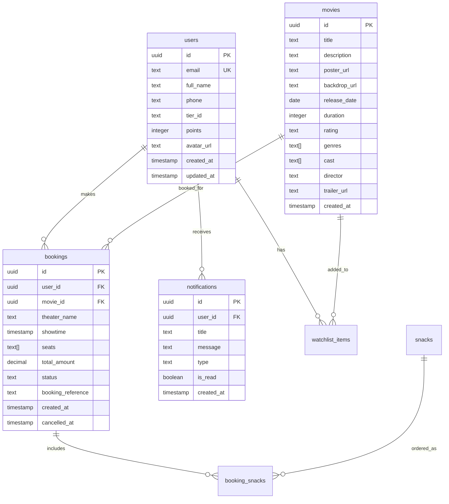

# Data Model Documentation

## 🗄️ **Database Schema Overview**

SCREEMA uses **PostgreSQL** via Supabase with **Row Level Security (RLS)** for data protection. The schema is designed for scalability, performance, and data integrity.

## 📊 **Entity Relationship Diagram**



## 🔐 **Row Level Security Policies**

### **Users Table**
```sql
-- Users can only see and update their own data
CREATE POLICY "Users can view own profile" ON users
    FOR SELECT USING (auth.uid() = id);

CREATE POLICY "Users can update own profile" ON users
    FOR UPDATE USING (auth.uid() = id);
```

### **Bookings Table**
```sql
-- Users can only see their own bookings
CREATE POLICY "Users can view own bookings" ON bookings
    FOR SELECT USING (auth.uid() = user_id);

-- Users can create bookings for themselves
CREATE POLICY "Users can create own bookings" ON bookings
    FOR INSERT WITH CHECK (auth.uid() = user_id);

-- Users can cancel their own bookings
CREATE POLICY "Users can cancel own bookings" ON bookings
    FOR UPDATE USING (auth.uid() = user_id);
```

### **Notifications Table**
```sql
-- Users can only see their own notifications
CREATE POLICY "Users can view own notifications" ON notifications
    FOR SELECT USING (auth.uid() = user_id);

-- Users can mark their own notifications as read
CREATE POLICY "Users can update own notifications" ON notifications
    FOR UPDATE USING (auth.uid() = user_id);
```

## 📋 **Table Definitions**

### **users**
Primary user account information and membership data.

| Column | Type | Constraints | Description |
|--------|------|-------------|-------------|
| `id` | `uuid` | PRIMARY KEY | User unique identifier (matches auth.users.id) |
| `email` | `text` | UNIQUE, NOT NULL | User email address |
| `full_name` | `text` | NOT NULL | User's full name |
| `phone` | `text` | | Phone number with country code |
| `tier_id` | `text` | DEFAULT 'bronze' | Current membership tier |
| `points` | `integer` | DEFAULT 0 | Loyalty points balance |
| `avatar_url` | `text` | | Profile picture URL |
| `created_at` | `timestamp` | DEFAULT now() | Account creation timestamp |
| `updated_at` | `timestamp` | DEFAULT now() | Last profile update |

**Indexes:**
- `idx_users_email` on `email`
- `idx_users_tier_points` on `tier_id, points`

### **movies**
Movie catalog with metadata and media assets.

| Column | Type | Constraints | Description |
|--------|------|-------------|-------------|
| `id` | `uuid` | PRIMARY KEY | Movie unique identifier |
| `title` | `text` | NOT NULL | Movie title |
| `description` | `text` | | Movie synopsis |
| `poster_url` | `text` | | Poster image URL |
| `backdrop_url` | `text` | | Background image URL |
| `release_date` | `date` | | Theatrical release date |
| `duration` | `integer` | | Runtime in minutes |
| `rating` | `text` | | MPAA rating (G, PG, PG-13, R) |
| `genres` | `text[]` | | Array of genre tags |
| `cast` | `text[]` | | Array of main cast members |
| `director` | `text` | | Director name |
| `trailer_url` | `text` | | YouTube trailer URL |
| `created_at` | `timestamp` | DEFAULT now() | Record creation timestamp |

**Indexes:**
- `idx_movies_release_date` on `release_date`
- `idx_movies_genres` on `genres` (GIN index)
- `idx_movies_title_search` on `title` (full-text search)

### **bookings**
User ticket reservations and transaction records.

| Column | Type | Constraints | Description |
|--------|------|-------------|-------------|
| `id` | `uuid` | PRIMARY KEY | Booking unique identifier |
| `user_id` | `uuid` | FOREIGN KEY | Reference to users.id |
| `movie_id` | `uuid` | FOREIGN KEY | Reference to movies.id |
| `theater_name` | `text` | NOT NULL | Theater/screen identifier |
| `showtime` | `timestamp` | NOT NULL | Movie showtime |
| `seats` | `text[]` | NOT NULL | Array of seat identifiers |
| `total_amount` | `decimal(10,2)` | NOT NULL | Total booking cost |
| `status` | `text` | DEFAULT 'confirmed' | Booking status |
| `booking_reference` | `text` | UNIQUE | Human-readable booking code |
| `created_at` | `timestamp` | DEFAULT now() | Booking creation timestamp |
| `cancelled_at` | `timestamp` | | Cancellation timestamp |

**Status Values:**
- `confirmed` - Active booking
- `cancelled` - User cancelled
- `expired` - Past showtime
- `refunded` - Payment refunded

**Indexes:**
- `idx_bookings_user_id` on `user_id`
- `idx_bookings_movie_showtime` on `movie_id, showtime`
- `idx_bookings_reference` on `booking_reference`

### **notifications**
User notification and messaging system.

| Column | Type | Constraints | Description |
|--------|------|-------------|-------------|
| `id` | `uuid` | PRIMARY KEY | Notification unique identifier |
| `user_id` | `uuid` | FOREIGN KEY | Reference to users.id |
| `title` | `text` | NOT NULL | Notification headline |
| `message` | `text` | NOT NULL | Notification body text |
| `type` | `text` | NOT NULL | Notification category |
| `is_read` | `boolean` | DEFAULT false | Read status |
| `created_at` | `timestamp` | DEFAULT now() | Notification timestamp |

**Notification Types:**
- `booking` - Booking confirmations/updates
- `promotion` - Marketing offers
- `system` - System announcements
- `tier` - Membership tier changes

**Indexes:**
- `idx_notifications_user_unread` on `user_id, is_read`
- `idx_notifications_type` on `type`

### **snacks**
Concession stand items and pricing.

| Column | Type | Constraints | Description |
|--------|------|-------------|-------------|
| `id` | `uuid` | PRIMARY KEY | Snack item identifier |
| `name` | `text` | NOT NULL | Item name |
| `description` | `text` | | Item description |
| `price` | `decimal(8,2)` | NOT NULL | Item price |
| `category` | `text` | NOT NULL | Item category |
| `image_url` | `text` | | Product image URL |
| `available` | `boolean` | DEFAULT true | Availability status |
| `created_at` | `timestamp` | DEFAULT now() | Record creation |

**Categories:**
- `popcorn` - Popcorn varieties
- `drinks` - Beverages
- `candy` - Confectionery
- `combos` - Value meal deals

### **booking_snacks**
Junction table for snack orders within bookings.

| Column | Type | Constraints | Description |
|--------|------|-------------|-------------|
| `id` | `uuid` | PRIMARY KEY | Order line identifier |
| `booking_id` | `uuid` | FOREIGN KEY | Reference to bookings.id |
| `snack_id` | `uuid` | FOREIGN KEY | Reference to snacks.id |
| `quantity` | `integer` | NOT NULL | Number of items |
| `unit_price` | `decimal(8,2)` | NOT NULL | Price per item |
| `total_price` | `decimal(8,2)` | NOT NULL | Line total |

### **watchlist_items**
User movie watchlist functionality.

| Column | Type | Constraints | Description |
|--------|------|-------------|-------------|
| `id` | `uuid` | PRIMARY KEY | Watchlist entry identifier |
| `user_id` | `uuid` | FOREIGN KEY | Reference to users.id |
| `movie_id` | `uuid` | FOREIGN KEY | Reference to movies.id |
| `added_at` | `timestamp` | DEFAULT now() | Addition timestamp |

**Constraints:**
- `UNIQUE(user_id, movie_id)` - Prevent duplicate entries

## 🔄 **Database Functions**

### **add_user_points()**
```sql
CREATE OR REPLACE FUNCTION add_user_points(
    user_id UUID,
    points_to_add INTEGER,
    reason TEXT DEFAULT 'Manual adjustment'
)
RETURNS JSON AS $$
DECLARE
    new_total INTEGER;
    old_tier TEXT;
    new_tier TEXT;
BEGIN
    -- Update user points
    UPDATE users 
    SET points = points + points_to_add,
        updated_at = now()
    WHERE id = user_id
    RETURNING points, tier_id INTO new_total, old_tier;
    
    -- Calculate new tier based on points
    new_tier := calculate_tier(new_total);
    
    -- Update tier if changed
    IF new_tier != old_tier THEN
        UPDATE users SET tier_id = new_tier WHERE id = user_id;
        
        -- Create tier upgrade notification
        INSERT INTO notifications (user_id, title, message, type)
        VALUES (
            user_id,
            'Tier Upgrade!',
            'Congratulations! You''ve been promoted to ' || new_tier || ' tier.',
            'tier'
        );
    END IF;
    
    RETURN json_build_object(
        'success', true,
        'new_total', new_total,
        'old_tier', old_tier,
        'new_tier', new_tier,
        'tier_changed', new_tier != old_tier
    );
END;
$$ LANGUAGE plpgsql SECURITY DEFINER;
```

### **generate_booking_reference()**
```sql
CREATE OR REPLACE FUNCTION generate_booking_reference()
RETURNS TEXT AS $$
BEGIN
    RETURN 'SCR-' || upper(substring(md5(random()::text) from 1 for 6));
END;
$$ LANGUAGE plpgsql;
```

## 📈 **Performance Optimizations**

### **Indexing Strategy**
- **Primary Keys**: Automatic B-tree indexes
- **Foreign Keys**: Explicit indexes for join performance
- **Search Fields**: Full-text search on movie titles
- **Array Fields**: GIN indexes for genre searches
- **Composite Indexes**: Multi-column indexes for common queries

### **Query Optimization**
```sql
-- Efficient user booking history
SELECT b.*, m.title, m.poster_url
FROM bookings b
JOIN movies m ON b.movie_id = m.id
WHERE b.user_id = $1
ORDER BY b.created_at DESC
LIMIT 20;

-- Fast movie search with genre filtering
SELECT * FROM movies
WHERE to_tsvector('english', title) @@ plainto_tsquery('english', $1)
AND genres && $2::text[]
ORDER BY release_date DESC;
```

### **Connection Pooling**
- **Supabase Pooler**: Automatic connection management
- **Max Connections**: 100 concurrent connections
- **Connection Timeout**: 30 seconds
- **Idle Timeout**: 10 minutes

## 🔄 **Real-time Subscriptions**

### **Seat Availability Updates**
```typescript
// Subscribe to booking changes for real-time seat updates
const subscription = supabase
  .channel('seat-updates')
  .on('postgres_changes', {
    event: '*',
    schema: 'public',
    table: 'bookings',
    filter: `movie_id=eq.${movieId}`
  }, handleSeatUpdate)
  .subscribe();
```

### **User Notifications**
```typescript
// Subscribe to new notifications for current user
const subscription = supabase
  .channel(`user-notifications:${userId}`)
  .on('postgres_changes', {
    event: 'INSERT',
    schema: 'public',
    table: 'notifications',
    filter: `user_id=eq.${userId}`
  }, handleNewNotification)
  .subscribe();
```

## 🔒 **Data Security**

### **Encryption**
- **At Rest**: AES-256 encryption for all stored data
- **In Transit**: TLS 1.3 for all connections
- **Sensitive Fields**: Additional encryption for PII

### **Access Control**
- **Row Level Security**: Database-level access control
- **JWT Tokens**: Stateless authentication
- **API Keys**: Separate keys for different environments
- **Audit Logging**: All data changes logged

### **Data Retention**
- **User Data**: Retained until account deletion
- **Booking History**: 7 years for financial records
- **Notifications**: 90 days automatic cleanup
- **Logs**: 30 days retention for debugging

---

*This data model supports the current application scale and provides a foundation for future growth.*