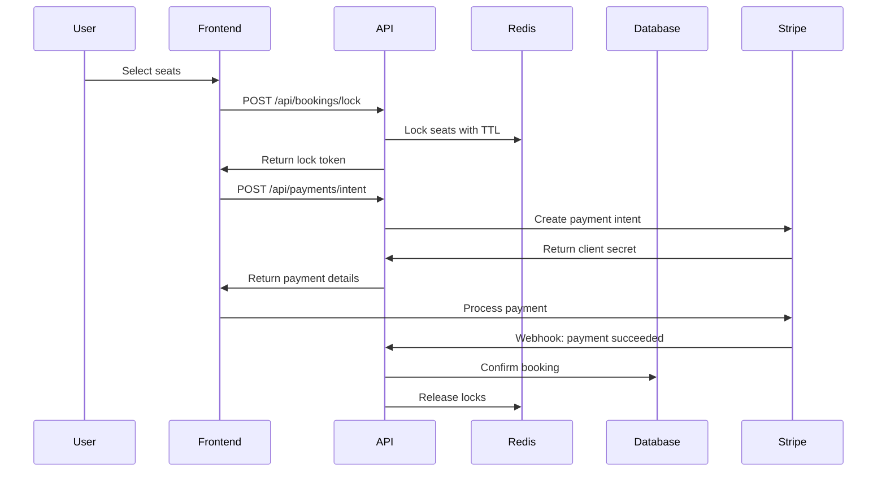

# SCREEMA Production Roadmap

## 🎯 **Current State Analysis**

### **✅ What's Strong**
- Professional frontend with React 18 + TypeScript
- Responsive UI with real-time seat selection interface
- Comprehensive documentation and CI/CD
- Professional repository practices

### **❌ Critical Gaps**
- **No real backend logic** - All complexity pushed to Supabase
- **Mock payment integration** - No real money workflows
- **No concurrency handling** - Seat locking not implemented
- **Missing production operations** - No real deployment hardening
- **Limited testing depth** - No integration or E2E tests

## 🚀 **Transformation Plan: Frontend Showcase → Production System**

---

## **Phase 1: Real Backend API (2-3 weeks)**

### **1.1 Backend Architecture**
```
Backend Stack:
- Node.js + Express/Fastify
- PostgreSQL (direct, not just Supabase)
- Redis for caching and seat locking
- JWT + refresh tokens
- Rate limiting + security middleware
```

### **1.2 Core Backend Services**

#### **Seat Locking Service**
```typescript
// Real concurrency handling
class SeatLockingService {
  async lockSeats(movieId: string, showtime: string, seats: string[], userId: string): Promise<LockResult> {
    // Redis-based distributed locking
    // Timeout-based automatic release
    // Conflict detection and resolution
  }
  
  async releaseLocks(lockId: string): Promise<void> {
    // Clean up expired locks
    // Handle payment failures
  }
}
```

#### **Booking Transaction Service**
```typescript
// Transactional booking with rollback
class BookingService {
  async createBooking(bookingData: BookingRequest): Promise<BookingResult> {
    const transaction = await db.beginTransaction();
    try {
      // 1. Verify seat availability
      // 2. Lock seats
      // 3. Calculate pricing with discounts
      // 4. Create booking record
      // 5. Initiate payment
      // 6. Generate ticket with QR code
      await transaction.commit();
    } catch (error) {
      await transaction.rollback();
      throw error;
    }
  }
}
```

#### **Ticket Management Service**
```typescript
// QR code generation and validation
class TicketService {
  async generateTicket(bookingId: string): Promise<Ticket> {
    // Generate QR code with expiration
    // Include booking details and validation hash
    // Store in database with security tokens
  }
  
  async validateTicket(qrCode: string): Promise<ValidationResult> {
    // Verify QR code authenticity
    // Check expiration and usage status
    // Log validation attempts
  }
}
```

### **1.3 Admin Management APIs**
```typescript
// Cinema operations management
class AdminService {
  async addMovie(movieData: MovieRequest): Promise<Movie> {}
  async createShowtime(showtimeData: ShowtimeRequest): Promise<Showtime> {}
  async manageTheater(theaterData: TheaterRequest): Promise<Theater> {}
  async viewBookingAnalytics(): Promise<Analytics> {}
}
```

---

## **Phase 2: Real Payment Integration (1-2 weeks)**

### **2.1 Stripe Integration**
```typescript
// Secure payment flow
class PaymentService {
  async createPaymentIntent(amount: number, bookingId: string): Promise<PaymentIntent> {
    // Create Stripe payment intent
    // Store payment metadata
    // Return client secret
  }
  
  async handleWebhook(event: StripeEvent): Promise<void> {
    switch (event.type) {
      case 'payment_intent.succeeded':
        await this.confirmBooking(event.data.object.metadata.bookingId);
        break;
      case 'payment_intent.payment_failed':
        await this.cancelBooking(event.data.object.metadata.bookingId);
        break;
    }
  }
}
```

### **2.2 Payment Security**
- Server-side payment processing only
- Webhook signature verification
- PCI compliance considerations
- 3D Secure handling
- Refund and chargeback management

---

## **Phase 3: Comprehensive Testing (1-2 weeks)**

### **3.1 Backend Unit Tests**
```typescript
// Seat locking concurrency tests
describe('SeatLockingService', () => {
  it('prevents double booking under concurrent load', async () => {
    // Simulate 100 concurrent booking attempts
    // Verify only one succeeds
  });
  
  it('releases locks after timeout', async () => {
    // Test automatic lock expiration
  });
});

// Payment flow tests
describe('PaymentService', () => {
  it('handles webhook events correctly', async () => {
    // Mock Stripe webhooks
    // Verify booking state changes
  });
});
```

### **3.2 Integration Tests**
```typescript
// End-to-end booking flow
describe('Booking Integration', () => {
  it('completes full booking with payment', async () => {
    // 1. Select seats
    // 2. Lock seats
    // 3. Process payment
    // 4. Generate ticket
    // 5. Send confirmation
  });
});
```

### **3.3 E2E Tests (Playwright)**
```typescript
// Real browser testing
test('user can complete booking flow', async ({ page }) => {
  await page.goto('/movies');
  await page.click('[data-testid="movie-card"]');
  await page.click('[data-testid="select-showtime"]');
  await page.click('[data-testid="seat-A1"]');
  await page.click('[data-testid="proceed-payment"]');
  // Test real payment flow (test mode)
  await expect(page.locator('[data-testid="booking-confirmation"]')).toBeVisible();
});
```

---

## **Phase 4: Authentication & Authorization (1 week)**

### **4.1 Role-Based Access Control**
```typescript
enum UserRole {
  CUSTOMER = 'customer',
  ADMIN = 'admin',
  OPERATOR = 'operator'
}

// Middleware for route protection
const requireRole = (roles: UserRole[]) => {
  return (req: Request, res: Response, next: NextFunction) => {
    if (!roles.includes(req.user.role)) {
      return res.status(403).json({ error: 'Insufficient permissions' });
    }
    next();
  };
};
```

### **4.2 Enhanced Security**
- JWT refresh token rotation
- Password reset with secure tokens
- Multi-factor authentication (optional)
- Rate limiting per user/IP
- Session management and logout

---

## **Phase 5: Production Deployment (1-2 weeks)**

### **5.1 Infrastructure Setup**
```yaml
# Docker Compose for local development
version: '3.8'
services:
  api:
    build: ./backend
    environment:
      - DATABASE_URL=${DATABASE_URL}
      - REDIS_URL=${REDIS_URL}
      - STRIPE_SECRET_KEY=${STRIPE_SECRET_KEY}
    ports:
      - "3001:3001"
  
  redis:
    image: redis:alpine
    ports:
      - "6379:6379"
  
  postgres:
    image: postgres:15
    environment:
      - POSTGRES_DB=screema
      - POSTGRES_USER=screema
      - POSTGRES_PASSWORD=${DB_PASSWORD}
```

### **5.2 Production Hosting**
- **Backend**: Railway/Render/AWS ECS
- **Database**: Supabase/PlanetScale/AWS RDS
- **Redis**: Upstash/AWS ElastiCache
- **Frontend**: Vercel (existing)
- **CDN**: Cloudflare for assets

### **5.3 Observability**
```typescript
// Logging and monitoring
import { Logger } from 'winston';
import * as Sentry from '@sentry/node';

class BookingService {
  async createBooking(data: BookingRequest) {
    const startTime = Date.now();
    try {
      logger.info('Booking creation started', { userId: data.userId });
      const result = await this.processBooking(data);
      logger.info('Booking created successfully', { 
        bookingId: result.id, 
        duration: Date.now() - startTime 
      });
      return result;
    } catch (error) {
      Sentry.captureException(error);
      logger.error('Booking creation failed', { error: error.message });
      throw error;
    }
  }
}
```

---

## **Phase 6: Technical Documentation (1 week)**

### **6.1 Architecture Documentation**


### **6.2 API Documentation (OpenAPI)**
```yaml
openapi: 3.0.0
info:
  title: SCREEMA Cinema API
  version: 2.0.0
paths:
  /api/bookings:
    post:
      summary: Create a new booking
      requestBody:
        required: true
        content:
          application/json:
            schema:
              $ref: '#/components/schemas/BookingRequest'
      responses:
        '201':
          description: Booking created successfully
          content:
            application/json:
              schema:
                $ref: '#/components/schemas/Booking'
```

---

## **🎯 Success Metrics**

### **Technical Metrics**
- **Backend Test Coverage**: 90%+
- **E2E Test Coverage**: Critical user flows
- **API Response Time**: <200ms p95
- **Concurrent Users**: Handle 1000+ simultaneous bookings
- **Uptime**: 99.9% availability

### **Business Metrics**
- **Real Payment Processing**: Handle actual transactions
- **Seat Conflict Resolution**: Zero double bookings
- **Ticket Validation**: QR codes work in production
- **Admin Operations**: Full cinema management

---

## **🚀 Portfolio Positioning**

### **New Project Description**
*"A Full-Stack Cinema Ticketing Platform with Real-Time Seat Locking, Stripe Payments, Concurrency Control, and Production Operations"*

### **Key Talking Points**
1. **Concurrency Mastery**: "Implemented distributed seat locking with Redis to prevent race conditions"
2. **Payment Integration**: "Built secure Stripe integration with webhook handling and PCI compliance"
3. **Production Operations**: "Deployed with monitoring, logging, and 99.9% uptime"
4. **Testing Excellence**: "90%+ test coverage with unit, integration, and E2E tests"
5. **Scalable Architecture**: "Designed to handle 1000+ concurrent users with horizontal scaling"

---

## **📋 Implementation Checklist**

### **Phase 1: Backend Foundation**
- [ ] Set up Node.js/Express API server
- [ ] Implement PostgreSQL database schema
- [ ] Add Redis for caching and locking
- [ ] Create seat locking service
- [ ] Build booking transaction service
- [ ] Add ticket generation with QR codes

### **Phase 2: Payment Integration**
- [ ] Set up Stripe account and API keys
- [ ] Implement payment intent creation
- [ ] Add webhook handling for payment events
- [ ] Build refund and cancellation logic
- [ ] Add payment security measures

### **Phase 3: Testing Infrastructure**
- [ ] Write comprehensive unit tests
- [ ] Add integration tests for booking flow
- [ ] Implement E2E tests with Playwright
- [ ] Set up test database and mocking
- [ ] Add performance testing

### **Phase 4: Production Deployment**
- [ ] Set up production hosting
- [ ] Configure environment variables
- [ ] Add monitoring and logging
- [ ] Implement security headers
- [ ] Set up SSL and domain

### **Phase 5: Documentation**
- [ ] Write API documentation
- [ ] Create architecture diagrams
- [ ] Add deployment instructions
- [ ] Document testing procedures
- [ ] Create demo video

---

This roadmap transforms SCREEMA from a frontend showcase into a **production-grade system** that proves real engineering capability and will stand out in any technical interview.